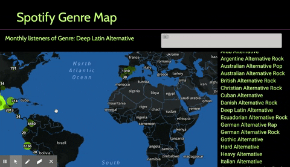

# Spotify Webscraper Project - [See it Deployed](https://project-2-spotify.herokuapp.com/)

This project uses Google Chrome's headless web brwosing via [Puppeteer](https://developers.google.com/web/tools/puppeteer) and Node.js to scrape the monthly listening info from all ~4000 unique Spotify genres from [Every Noise at Once](http://everynoise.com/) (Website which we gained inspiration from, shout out to **Glenn McDonald**), then we use the top two artists from each genre to populate the monthly listening info from all genres worldwide using [Spotify's Web Player](http://open.spotify.com) and scraping each Artist's pages listening data. This data is Then stored in a MySql database and using Third Normal Form we can visualize the monthly listening data from every genre on Spotify worldwide, at once on the website using Mapbox and GEOJSON data. See the gif below for a quick demo or visit the Deployed Site.

## Deployment

Deployed to Heroku - https://project-2-spotify.herokuapp.com/

## Built With

Puppeteer
Cheerio
Node
Sequelize
Mysql2
Mapbox
Select2
Scrape.js
Autoscrape.js
Materialize

## Contributing

Authors reserve all rights for any suggested contributions. 

## Versioning

Version 1.0.0

## Authors

Luke Olson
Jeff Arriaga
Matthew Reilly
Daniel Hawn
Cooper Pearson

## License

Copyleft U+00A9 2020

## Acknowledgments
* We by no means are connected to **Spotify** in any way. This project was a learning experience and we hold no intent to profit off of this.

* Hat tip to Osei Bonsu, Sangeetha Kaliaperumal
